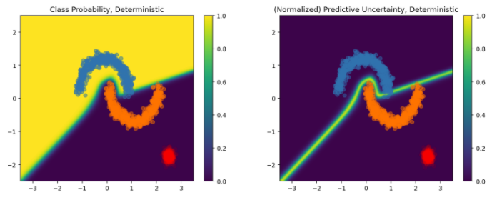

# Uncertainty-aware Deep Learning with SNGP

Uncertainty-aware deep learning with Spectral-normalized Neural Gaussian Process (SNGP). 

In safety-critical AI applications or cases where data is inherently noisy, it's important for a model to be able to reliably quantify its uncertainty, and know when it should notify human experts to handle the example.

SNGP improves a deep classifier's *distance awareness* by applying modifications to the network, including spectral normalization to hidden residual layers and replacing the Dense output layer with a Guassian process layer.

Using the [two moon dataset](https://scikit-learn.org/stable/modules/generated/sklearn.datasets.make_moons.html), we train and test a 6-layer ResNet model with 128 hidden units and dropout regularization on the dataset as our baseline DNN. Following, we compute the class probabilities and predictive uncertainty to yield results:

Afterwards, we replicate the DNN ResNet architecture from above, but wrap the model within an SNGP model. After training, testing and computing the class probabilities and predictive uncertainty we yield results:

With SNGP, our class probabilities transitioned to 0.5 (ie random guessing) for data examples outside the training examples (blue and orange clusters). The predictive uncertainty of the model increased to 1 as we transitioned to these regions, so the out-of-domain (OOD) examples (red) were detectable by the SNGP model.

